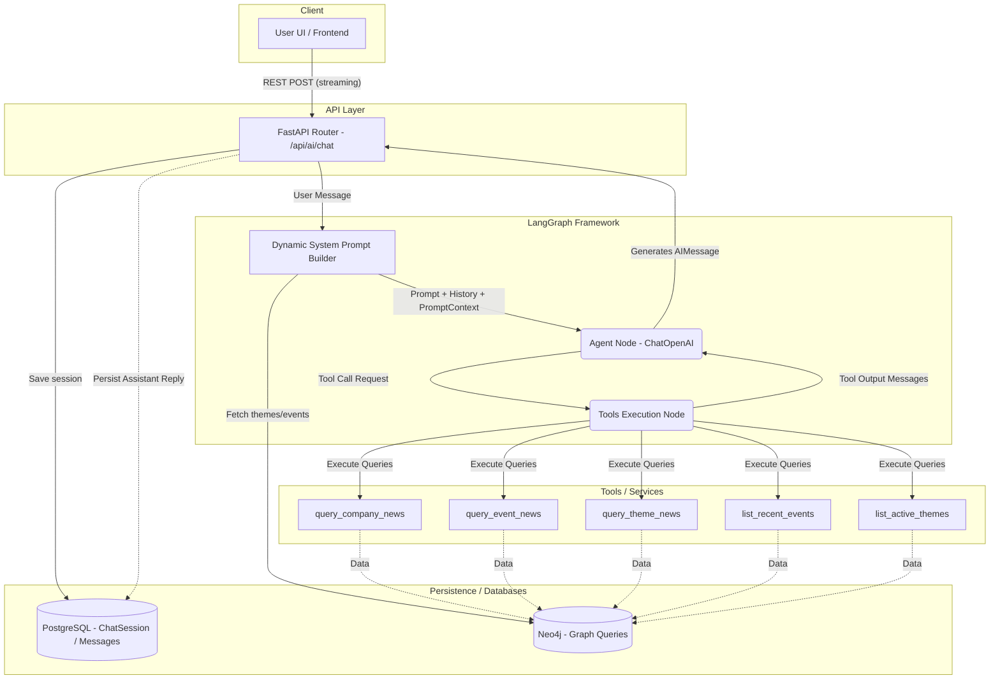

# LLM Agent Architecture

This document outlines the architecture of the AI Agent integrated into the application, designed to assist users with financial data via natural language. The architecture is primarily built using [LangChain](https://python.langchain.com/) and [LangGraph](https://python.langchain.com/docs/langgraph).

## Overview

The intelligence layer is driven by an agentic loop constructed with LangGraph. The graph utilizes a stateful approach (`MessagesState`) to keep track of the chat history and the intermediate steps taken by the Large Language Model (LLM) utilizing function calling (tools).

At its core:

- **Model**: OpenAI (`ChatOpenAI`) configured via environment variables.
- **State**: Standard `MessagesState` which maintains the message list in the graph.
- **Persistence**: Chat sessions and messages are stored in PostgreSQL using SQLAlchemy asynchronously.
- **Context Injection (Global Grounding)**: The `_build_system_prompt` dynamically retrieves current macro themes and events from the Neo4j Knowledge Graph to steer the LLM accurately before any tool calls are made.

## Architecture Flow

The architecture features a dynamic system prompt generation, an LLM reasoning node ("agent"), and a tool execution node ("tools"). The LLM decides whether it needs to invoke tools to satisfy a user request. If tools are invoked, the graph routes execution to the tools node, executes the functions, and sends the results back to the agent node to compile the final answer.

## Key Components

### 1. API Endpoints (`backend/app/routes/ai_agents.py`)

- **`/sessions`**: CRUD operations for managing user chat sessions.
- **`/chat`**: Provides a Server-Sent Events (SSE) streaming endpoint using `StreamingResponse`. It auto-creates sessions, parses input, triggers `compiled_graph.astream()`, and saves the conversation asynchronously.

### 2. Graph Definition (`backend/app/ai/graph.py`)

The logic engine compiled by `StateGraph`.

- **Nodes**:
  - `agent`: Invokes the LLM equipped with tools and the system context.
  - `tools`: A specialized prebuilt `ToolNode` that intercepts requests from the `agent` to run internal Python async code.
- **Edges**: Conditional edge via `tools_condition` determines whether an assistant's response completes the loop or triggers a tool step.

### 3. Agent Tools (`backend/app/ai/graph.py`)

The LLM can access up-to-date Neo4j graph data indirectly using defined asynchronous tool functions:

- `query_company_news`: Fetch recent news by ticker.
- `query_event_news`: Fetch articles linked to specific named events.
- `query_theme_news`: Fetch macro theme insights.
- `list_recent_events`: Overview of major recent events.
- `list_active_themes`: Retrieve trending narrative themes.

### 4. Graph Routes (`backend/app/routes/graph.py`)

These are standard REST endpoints that mirror some of the capabilities of the agent tools, intended for manual UI querying (e.g., direct heatmaps, active themes, or entities data) outside the chat scope.
